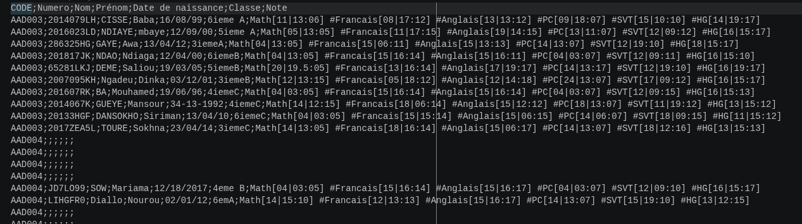
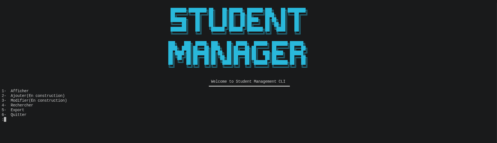
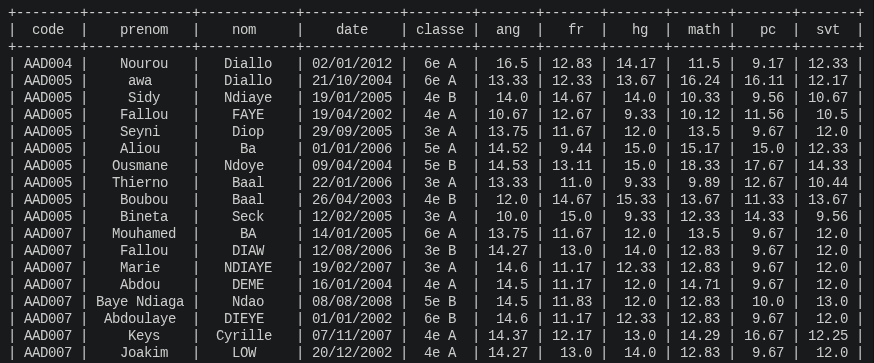

[](https://github.com/yba01/student_management_cli/blob/master/README.en.md)
# Student Management CLI

## Description

Ce projet est une application de gestion d'étudiants en Python orientée objet. Il permet de lire un fichier CSV de données étudiantes, de parser les notes, de valider les entrées, et d'afficher des rapports via une interface de ligne de commande.

### Objectifs
- Charger les données depuis un fichier CSV
- Créer des objets étudiants et notes
- Valider les informations de chaque étudiant
- Afficher des listes d'étudiants valides ou invalides
- Rechercher des étudiants par numéro ou code
- Modifier les informations invalides d'un étudiants
- Ajouter un nouvel étudiants
- Exporter les étudiants valides vers un fichier JSON

## Structure du projet

```
student_management/
  main.py
  interface/
    menu.py
  model/
    date.py
    etudiant.py
    note.py
  services/
    gestion_donnees.py
    validator.py
  utils/
    data_reader.py
    parser_notes.py
  data/
    Donnees_Projet_Python_Dev_Data.csv
  valid.json
```

### Modules clés
- `student_management/main.py` : point d'entrée de l'application
- `student_management/interface/menu.py` : interface utilisateur CLI
- `student_management/services/gestion_donnees.py` : logique d'affichage, recherche et export JSON
- `student_management/services/validator.py` : règles de validation des étudiants et notes
- `student_management/utils/data_reader.py` : lecture et transformation du CSV en objets
- `student_management/utils/parser_notes.py` : parsing des notes formatées
- `student_management/model/etudiant.py` : modèle d'un étudiant
- `student_management/model/note.py` : modèle d'une note
- `student_management/model/date.py` : normalisation et validation des dates

## Fonctionnalités

- Lecture des données étudiantes depuis un CSV
- Validation des champs suivants :
  - code étudiant (`AAA111`)
  - numéro étudiant (`7 caractères alphanumériques`)
  - prénom / nom
  - classe (format `3e A`, `4e B`, etc.)
  - date de naissance au format `dd/mm/yy`, `dd/mm/yyyy` ou `dd/nom_mois/yyyy`
  - notes pour les matières : math, pc, svt, ang, fr, hg
- Affichage des étudiants valides ou invalides via tables formatées
- Recherche par numéro d'étudiant ou par code
- Calcul des moyennes par matière pour les étudiants valides
- Export JSON des étudiants valides dans `valid.json`

## Prérequis

- Python 3.10+
- Package Python :
  - `prettytable`

### Installation

```bash
pip install prettytable
```

## Utilisation

1. Ouvrir un terminal dans le dossier `student_management`
2. Lancer l'application :

```bash
python3 main.py
```

3. Suivre les options du menu :
- `1` : afficher les données (valide/invalide)
- `2` : ajouter un étudiant (fonctionnalité non implémentée)
- `3` : modifier un étudiant (fonctionnalité non implémentée)
- `4` : rechercher un étudiant par numéro ou code
- `5` : exporter les données des étudiants valides
- `6` : quitter


## Format attendu des données

Le fichier CSV `student_management/data/Donnees_Projet_Python_Dev_Data.csv` doit contenir des lignes structurées avec un séparateur `;` et les colonnes suivantes :

- code
- numéro
- nom
- prénom
- date
- classe
- notes

Chaque note doit être encodée sous la forme :

```
math[devoir1|devoir2:examen]#pc[...]#svt[...]#fr[...]#ang[...]#hg[...]
```

Par exemple :

```
ABC123;1234XYZ;Dupont;Jean;12/03/2004;4A;math[10|12:15]#pc[11|14:16]#svt[12|13:17]#fr[14|15:16]#ang[10|13:18]#hg[12|14:16]
```

## Export JSON

L'option `Export` déclenche la génération de `valid.json`, contenant les données des étudiants valides au format JSON.

## Améliorations possibles

- Implémenter les méthodes `ajouter()` et `modifier()` dans `student_management/interface/menu.py`
- Utiliser des chemins relatifs au lieu d'un chemin absolu dans `GestionDonnees`
- Ajouter la gestion d'une base de données ou un stockage persistant
- Ajouter des tests unitaires
- Améliorer le parsing des notes pour gérer des formats plus variés(*il n' y a pas de format standard pour les notes, donc le parsing dépendra du format disponible.)

## Notes

- Le projet est conçu pour une utilisation en console.
- Le chemin de lecture du CSV est actuellement codé en dur dans `student_management/services/gestion_donnees.py`.
- `prettytable` est utilisé pour afficher des tableaux lisibles en CLI.


##  Screenshots
####  CSV file



####  CLI Interface



#### Table de données valides


## Ce que j'ai appris

À travers ce projet, j'ai appris et pratiqué :

- Structurer un vrai projet Python avec une architecture modulaire
- Appliquer les concepts de la Programmation Orientée Objet (POO)
- Créer et manipuler des classes et des objets Python
- Séparer les responsabilités entre les modèles, les services, les utilitaires et l’interface utilisateur
- Lire et traiter des fichiers CSV
- Exporter des données structurées au format JSON
- Parser des données semi-structurées
- Valider les données utilisateur et étudiantes
- Utiliser des expressions régulières pour la validation des entrées
- Construire une interface interactive en ligne de commande (CLI)
- Gérer les entrées invalides et les cas particuliers
- Implémenter des fonctionnalités de recherche et de filtrage
- Organiser la logique métier dans des services réutilisables
- Utiliser des tableaux formatés dans le terminal avec `prettytable`
- Améliorer la lisibilité et la maintenabilité du code
- Concevoir une structure d’application scalable et maintenable
- Réfléchir à l’architecture logicielle et aux bonnes pratiques de clean code

## Auteur

Développé par @yba01.

---

## License

This project is licensed under the MIT License.